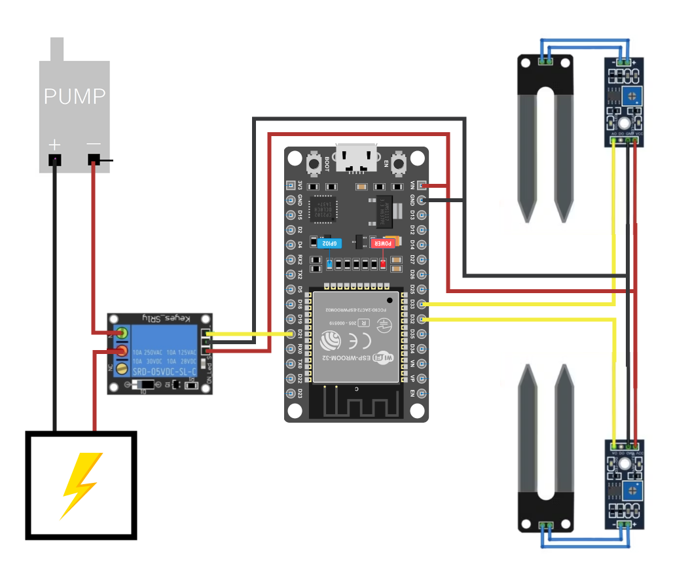

# Plantter

Sebuah perangkat IoT untuk penyiraman tanaman. Perangkat ini berkerja dengan membaca tingkat kelembapan tanah dan mengirimnya melalui internet ke Telegram pengguna.

## Fitur

1. Mode Active

    Pada mode Active, perangkat akan bekerja secara otomatis dengan membaca kelebapan tanah secara berkala. Jika kelembapan tanah terdeteksi keringa, perangkat akan otomatis menyiram dengan menjalankan pompa dan akan berhenti ketika tanah sudah terdeteksi kering.

2. Mode Lazy

    Mode ini membuat perangkat bekerja dengan cara mengirimkan pesan ke pengguna jika tanah terdeteksi kering dan menunggu pengguna untuk menyalakan pompa dengan perintah tertentu. Pompa kemudian akan berhenti secara otomatis jika tanah sudah terdeteksi basah.

## Hardware

1. ESP32 Board Microcontroller
2. Soil Hygrometer Detection Module
3. Relay Singgle Chanel 5V
4. Water Pump 12V
5. Adaptor AC to DC 12V

## Circuit

Baca laporan lengkapnya [di sini](./report/Proyek_TIoT_Kelompok_3.pdf)

## Tentang Kami

Proyek ini kami garap dalam rangka untuk memenuhi tugas akhir mata kuliah Teknologi Ineternet of Things yang diampuh oleh Ibu Hariani, Semester 6 Tahun ajaran 2023/2024.

Kami beranggotakan 5 orang di Kelompok 3:

- Ifa
- Nutfa
- Alyan
- Zafran
- Zuma

[Link Dokumentasi Aktifitas Kami](https://drive.google.com/drive/folders/1-23xjYpDEIJITB-eSblmLmBgEG_e_0JK)